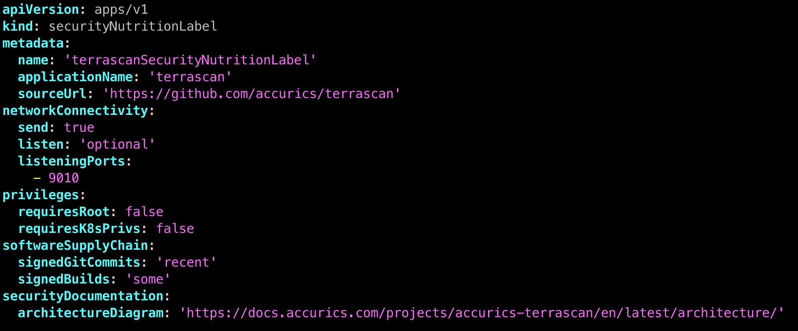

# Security Nutrition Labels for Cloud Native Projects

This repo contains the files for my cloud-native security day talk,
as well as sample documents describing a machine-readable "nutrition
label" for an open source project.

The idea here is how can we provide transparency into open source projects by clearly communicating the security requirements and maturity of the project.

Here's one example of a security nutrition label:

